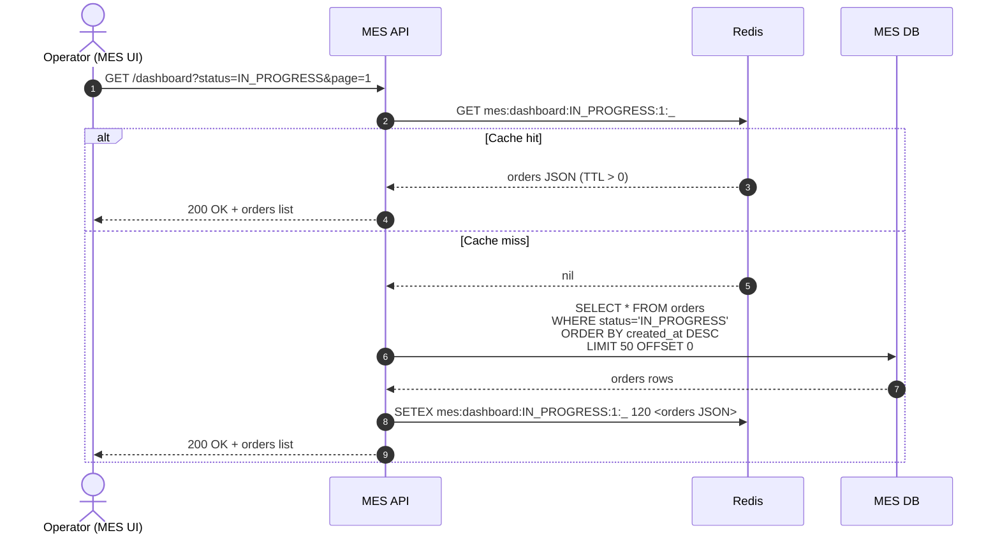
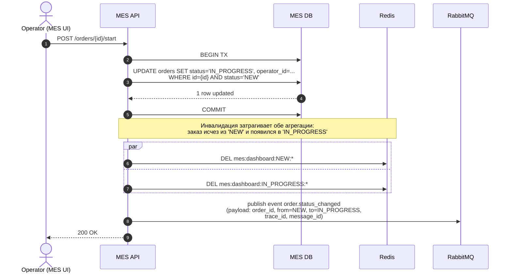
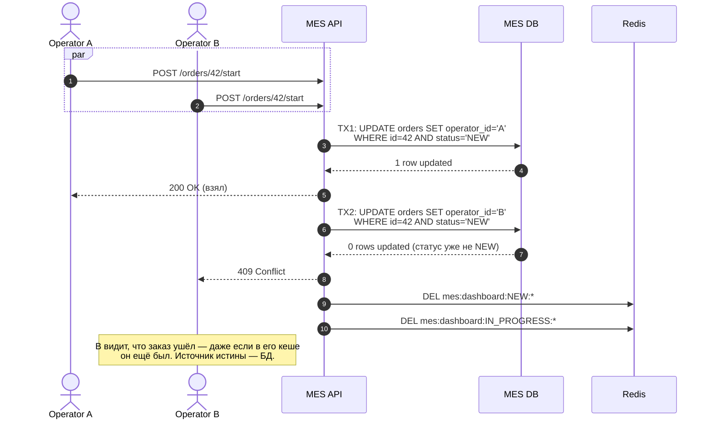

# Архитектурное решение по кешированию

## 1. Анализ — что имеет смысл кешировать

Главная боль из условий задания и Task 1:

> «операторы жалуются на скорость работы со страницей, на первой странице MES
> отображается список заказов в работе по статусам — это дашборд с фильтром.
> Раньше страница показывала все заказы, но это тормозило загрузку. Команда сделала
> фильтр по статусам и пагинацию, но это не помогло».

Это **дашборд оператора MES** — главный кандидат на кеширование.

Дополнительно (с меньшим приоритетом) — **результаты расчёта цены по хешу 3D-модели**
(см. Task 1, инициатива B3). Сценарий: одни и те же / похожие модели приходят
повторно — отдавать ранее посчитанную цену из кеша вместо 2–30 минутного расчёта.
Но это не покрывается напрямую жалобами операторов, поэтому **в этом документе
фокусируемся на дашборде**, а кеш расчётов вынесен в раздел «Дальнейшее развитие».

### Свойства данных дашборда — почему вообще можно кешировать

| Свойство | Значение | Вывод |
|---|---|---|
| Частота **чтения** | каждые 5–15 секунд от каждого оператора (5–10 операторов) → десятки RPS | Read-heavy → кеш окупается |
| Частота **записи** (смена статуса) | десятки изменений в час | Очень редкие записи относительно чтений |
| Допустимое **отставание** данных от истины | Низкое (1–2 секунды) — операторы соревнуются за заказы | Нужна **синхронная инвалидация по событиям**, не голый TTL |
| Объём | ~10 статусов × до ~50 заказов на странице = небольшие списки (~50 КБ JSON на ключ) | Дёшево хранить в Redis |
| Природа данных | Производные (агрегация по статусу + пагинация + фильтр) | Идеально для кеша — пересчёт из БД дорогой, результат компактный |

Это **классический** сценарий «горячая выборка», который Redis-кеш закрывает в полный рост.

---

## 2. Мотивация

### Что болит
- Долгая загрузка дашборда → оператор не видит новые заказы вовремя.
- Зависит от этого **вознаграждение операторов** («кто взял заказ, тот и получит оплату»).
- Тяжёлый запрос к MES DB бьёт по той же базе, которая обслуживает запись —
  замедляя саму смену статуса.
- При росте операторов и/или заказов (+100 в месяц по условиям) деградация
  усиливается линейно.

### Что мы решаем кешированием
- **Снижение латентности дашборда** в десятки раз (вместо тяжёлого SQL — Redis
  lookup за < 1 мс).
- **Снижение нагрузки на MES DB** (запросы дашборда сводятся почти к нулю при
  холодном промахе).
- **Освобождение MES API**, чтобы он мог обслуживать запись и расчёт цены без
  затыков.

### Метрики решения

| Метрика | Сейчас | Цель |
|---|---|---|
| p95 латентности `GET /dashboard?status=X` | ? (по жалобам — секунды) | < 100 мс |
| RPS на тяжёлые SELECT для MES DB | высокий (каждый оператор раз в 5–15 с) | -90% (только cache misses + инвалидации) |
| Среднее время «увидеть свежий заказ» от смены статуса | заметное при тормозах | < 1–2 с (программная инвалидация) |
| % операторских жалоб на «не успел взять заказ» | высокий | вблизи нуля |

---

## 3. Предлагаемое решение

### 3.1 Клиентское или серверное кеширование?

**Серверное.** Почему не клиентское:

| Аспект | Клиентское (в браузере MES UI) | Серверное (Redis рядом с MES API) |
|---|---|---|
| **Кто видит свежие изменения других операторов** | Никто — каждый кеширует у себя | Все — кеш общий |
| **Конкуренция за заказ** («кто взял — тот получил оплату») | Сломана: один оператор увидит обновление позже | Сохранена: следующий запрос всех операторов идёт в общий кеш |
| **Инвалидация при смене статуса** | Сложна (WebSocket / push в каждую вкладку) | Тривиальна (DEL ключ в Redis) |
| **Дубликат данных у каждого пользователя** | N × M (растёт с пользователями) | 1 копия |
| **Защита от перегрузки сервера** | Помогает (меньше запросов вообще) | Достигается общим Redis |

Клиентское кеширование (HTTP `Cache-Control` или React Query) тут **противопоказано**:
из-за конкуренции операторов за заказы устаревшие данные у одного пользователя
ломают честность системы вознаграждений.

**Решение — серверный кеш в Redis**, общий для всех инстансов MES API
(будет 2+ реплики после переезда в K8s — см. Task 1, инициатива C1).

### 3.2 Паттерн кеширования

Выбираю **Cache-Aside (Lazy Loading)** с программной инвалидацией по событиям и
дополнительным TTL как страховкой.

#### Сравнение паттернов

| Паттерн | Как работает | Подходит нам? | Почему |
|---|---|---|---|
| **Cache-Aside** | App → Cache (miss → DB → put в Cache); запись → DB + INVALIDATE/UPDATE кеш | **ДА** | Простой; запись редкая → инвалидация не бьёт по производительности |
| **Write-Through** | App → Cache → DB (синхронно); read только из Cache | Нет | Кеш дашборда — **агрегация**, не отдельные заказы. Write через cache требует пересчёта агрегаций на каждой записи — дорого |
| **Refresh-Ahead** | Фоновый воркер обновляет ключ до истечения TTL | Частично, как дополнение | Имеет смысл для очень горячих ключей (`status=IN_PROGRESS`), но не как основной паттерн — не отвечает на изменение статуса; стоит дополнительной сложности |
| **Read-Through** | Cache сам ходит в БД (через библиотеку/прокси) | Не нужен | Эквивалент Cache-Aside «изнутри», без выгоды для нашего стека |

**Окончательный выбор:**
- **Cache-Aside** как основной паттерн.
- **Программная инвалидация по событиям** (`order.status_changed`) — для свежести.
- **TTL 120 с** — как safety net на случай пропущенной инвалидации.
- (Опционально, через 6 месяцев) **Refresh-Ahead** для топ-1 самого горячего
  ключа (`status=NEW` или `status=IN_PROGRESS`) — фоновый прогрев кеша.

### 3.3 Что именно кешируется

**Ключ кеша:**
```
mes:dashboard:{status}:{page}:{filter_hash}
```

Где:
- `status` — статус заказа (NEW, IN_PROGRESS, …);
- `page` — номер страницы пагинации;
- `filter_hash` — sha1 от прочих фильтров оператора (если есть).

**Значение:** сериализованный JSON со списком заказов на странице + total count.

**TTL:** 120 секунд (страховка).

---

## 4. Sequence-диаграммы

Диаграммы написаны в **Mermaid** — GitHub рендерит их прямо в markdown.

### 4.1 Чтение списка заказов (дашборд)



### 4.2 Запись об изменении статуса заказа



Заметки к диаграмме:
- **DEL по паттерну** (`*`) делается через `SCAN` + `DEL` (либо через
  Redis-helper `unlink` с pattern, либо явное хранение списка ключей в Set'е
  и удаление по нему — для prod-нагрузки это безопаснее, см. раздел 6).
- Публикация в RabbitMQ — стандартная связь MES → CRM из задания. Это
  позволяет CRM (а в будущем — read-only-репликам других сервисов) сделать
  свою инвалидацию своих кешей.
- Содержимое сообщения включает `trace_id` (Task 3) и `message_id` для
  идемпотентности (Task 1, инициатива C3).

### 4.3 Сценарий «race condition» — два оператора, один заказ

Иллюстрация, как защищает БД-блокировка + наш паттерн от двойного взятия одного
заказа двумя операторами:



Ключевая фраза: **источник истины — БД, кеш только ускоряет чтение**. Кеш
никогда не используется для принятия решения о взятии заказа.

---

## 5. Стратегия инвалидации

### 5.1 Какие стратегии существуют

| Стратегия | Описание |
|---|---|
| **Временная (TTL)** | Запись «протухает» через N секунд независимо от изменений в БД |
| **По ключу (event-based)** | При изменении данных приложение **вручную удаляет/обновляет** соответствующие ключи |
| **Программная (write-through)** | Запись в БД сразу пишет в кеш — данные всегда свежие |
| **По версии / staleness checks** | Каждое значение хранит метку версии; чтение сверяет её с БД-версией |

### 5.2 Сравнение применительно к нашему сценарию

| Стратегия | За | Против | Подходит? |
|---|---|---|---|
| **Временная (TTL only)** | Просто, без логики в коде | Окно устаревания = TTL. При TTL=60 с оператор узнаёт о новом заказе через минуту → ломает конкуренцию | **Нет** как основной механизм. **Да** как safety net |
| **По ключу (программная инвалидация по событиям `order.status_changed`)** | Свежесть данных < 1–2 с; нагрузка на Redis минимальна; код простой | Нужно явно вызвать `DEL` в каждой ветке кода, где меняется статус. Один пропущенный вызов = багу с устаревшими данными | **Да** — основной механизм |
| **Программная (write-through)** | Кеш всегда консистентен | На уровне агрегаций (наш случай) требует пересчёта всей выборки при каждой записи → дорого | **Нет** — для агрегатов невыгодно |
| **По версии** | Аккуратно для нескольких реплик кеша; не требует push-инвалидации | Лишний раунд-трип в БД при каждом чтении; сложнее код | **Нет** — наш Redis один экземпляр |

### 5.3 Окончательное решение

**Двухуровневая стратегия:**

1. **Основная: программная инвалидация по событиям.** При смене статуса заказа в
   MES API после успешного `COMMIT` транзакции выполняется `DEL` всех релевантных
   ключей (см. sequence в 4.2). Также при получении сообщения `order.status_changed`
   из RabbitMQ — аналогичный `DEL`. Это гарантирует свежесть данных за время <1 с.

2. **Резервная: TTL = 120 секунд.** Даже если разработчик забыл вызвать `DEL` в
   новом месте кода, через 2 минуты кеш самообновится. Это страховка от ошибок
   и от пропуска события (например, если RabbitMQ-event потерян и не дошёл до
   обработчика).

3. **Идемпотентность инвалидации.** `DEL` идемпотентен — повторный вызов
   безопасен. Если событие `order.status_changed` приходит дважды (из-за ретрая),
   ничего не сломается.

### 5.4 Сложные моменты и как с ними справляемся

| Проблема | Решение |
|---|---|
| **`DEL pattern` дорог в Redis** (`SCAN` блокирует ноду) | Хранить **отдельный Set ключей по статусу**: `mes:dashboard:keys:IN_PROGRESS = {...}`. При смене статуса — `SMEMBERS` → `DEL ...` → `DEL` самого сета. Это O(N) от числа страниц, обычно ≤ 5. |
| **Кеш-стампида** (одновременный miss → толпа в БД) | Использовать `SET NX` lock на ключ: первый промах берёт лок, читает БД, кладёт в кеш; остальные ждут 50 мс и пробуют ещё раз. |
| **Stale read во время инвалидации** (между `UPDATE` и `DEL`) | Окно ~миллисекунды. На бизнес-уровне допустимо (никто не примет решение за это окно). Реальные ACID-гарантии у БД. |
| **Падение Redis** | MES API ходит напрямую в БД — деградация по скорости, но не отказ функциональности. Redis должен запускаться с `--maxmemory-policy allkeys-lru` и persistence-настройками под Sentinel или Cluster в prod. |

---

## 6. [Доп.] Альтернативные решения и сравнение

Поскольку у задачи есть **несколько разумных вариантов**, опишу два и выберу.

### Решение 1. Redis cache (Cache-Aside) — основное

**Описание:** отдельный Redis рядом с MES API. Cache-Aside + программная
инвалидация + TTL safety net (см. разделы 3–5).

```
   Operator (MES UI)
        │
        ▼
     MES API ──read──▶ Redis ──miss──▶ MES DB
                                       │
                                       └──invalidate (DEL)
```

**Плюсы:**
- Низкая латентность чтения (< 1 мс).
- Чёткое разделение ответственности: БД хранит истину, кеш ускоряет.
- Опыт команды (Redis — стандарт), куча готовых клиентов в Java/C#.
- Легко горизонтально масштабировать (Redis Cluster при росте).
- Дешёво по ресурсам (~ 100 МБ RAM на наш масштаб).

**Минусы:**
- Дополнительная инфраструктурная сущность (нужно поднять, мониторить, бэкапить).
- Сложность кода: явная инвалидация в местах изменения статуса.
- Распределённая консистентность: кеш и БД — два источника, риск рассинхронизации.

### Решение 2. Materialized View в PostgreSQL — альтернатива

**Описание:** в самой MES DB создаётся `MATERIALIZED VIEW` под дашборд
(агрегаты по статусам с правильными индексами). Триггеры на `UPDATE` таблицы
`orders` вызывают `REFRESH MATERIALIZED VIEW CONCURRENTLY`. MES API читает из view.

```
   Operator (MES UI)
        │
        ▼
     MES API ──read──▶ MES DB ──view──▶ underlying table
                          │
                          └ trigger: REFRESH on update
```

**Плюсы:**
- Не появляется новой инфраструктуры (Redis не нужен).
- Один источник истины — БД. Никаких рассинхронизаций кеша.
- Транзакционная согласованность: refresh виден ровно после `COMMIT`.

**Минусы:**
- `REFRESH MATERIALIZED VIEW` — **дорогая операция**, держит блокировку на write
  (даже `CONCURRENTLY` пересчитывает всё), может занимать секунды на больших таблицах.
- Латентность чтения остаётся секундами (БД-запрос), пусть и быстрее, чем
  без view — но не миллисекундами.
- Refresh ⇒ та же БД, нагрузка переходит с одного запроса на другой; не
  разгружает PostgreSQL так, как разгружает кеш.
- При росте таблицы (естественный рост на 100 заказов/мес) refresh всё дольше.
- Не масштабируется: если MES API распилим на 5 реплик и трафик вырастет,
  узким местом останется одна PG-нода.

### Сравнительная таблица

| Аспект | Решение 1: Redis Cache-Aside | Решение 2: PG Materialized View |
|---|---|---|
| **Латентность чтения** | < 1 мс (hit), ~100 мс (miss) | ~100–500 мс (читает из view, но всё ещё SQL) |
| **Сложность реализации** | Средняя (Redis + код инвалидации) | Низкая (DDL + триггер) |
| **Новая инфра** | Да (Redis) | Нет |
| **Нагрузка на БД** | Снижается на 80–95% | Не снижается, перераспределяется |
| **Свежесть данных** | < 1–2 с (программная инвалидация) | Зависит от refresh — секунды до минут |
| **Масштабирование (HA, шардинг)** | Отлично (Redis Cluster) | Плохо (одна PG-нода — узкое место) |
| **Стоимость при росте × 10** | Линейная (+ ноды Redis) | Болезненная — refresh всё дольше |
| **Риск рассинхронизации** | Есть (баг инвалидации → stale), смягчается TTL | Нет |

### Заключение

**Выбираем Решение 1 (Redis Cache-Aside).** Аргументы:

1. **Прямое решение боли** — операторам нужна суб-секундная страница. View
   даст ускорение, но не миллисекунды.
2. **Снимает нагрузку с БД**, а не перераспределяет. Это важно потому, что
   та же БД обслуживает запись (смену статуса), которую тормозит тяжёлый
   read-трафик.
3. **Масштабируется вместе с MES API** — когда MES API будет в Kubernetes с
   HPA (Task 1, инициатива C1), Redis cluster масштабируется отдельно и
   независимо.
4. **Опыт команды и стандартность стека** — Redis в любом Java/C#-проекте
   делается за час. Materialized View — это специфическая PG-фича, которую
   надо аккуратно сопровождать (`pg_repack`, anti-bloat, refresh-расписания).

Materialized View может появиться **в будущем** для других сценариев (например,
ночные аналитические отчёты для администраторов), но не для горячего OLTP-сценария
дашборда.

---

## 7. Дальнейшее развитие — кеш расчёта цены

Кратко (вне основной задачи документа): второй кандидат на кеширование —
**результаты расчёта цены по хешу 3D-модели** (Task 1, B3).

- **Ключ:** `mes:price:{sha256(model_bytes)}:{material}:{quality_setting}`.
- **Значение:** результат расчёта (цена, метаинформация).
- **TTL:** очень длинный (дни/недели) — расчёт детерминирован по модели и параметрам.
- **Инвалидация:** только когда меняется логика расчёта или прайс-лист
  материалов → ручной flush из админ-панели.
- **Эффект:** одинаковая модель, переотправленная B2B-партнёром, обрабатывается
  за миллисекунды вместо 2–30 минут.

Это отдельная инициатива, реализуется после распила расчёта цены в
async-worker (Task 1, B2).

---

## 8. Резюме

- **Что кешируем:** дашборд оператора MES (список заказов по статусам с пагинацией).
- **Тип:** серверный (общий для всех инстансов MES API).
- **Технология:** Redis.
- **Паттерн:** **Cache-Aside (Lazy Loading)**. Read через cache, write — DB +
  явная инвалидация ключей. Write-Through неудобен из-за того, что кеш — это
  агрегации, а не отдельные заказы.
- **Инвалидация:** двухуровневая. Программная по событию `order.status_changed`
  (свежесть < 1–2 с) + TTL 120 с как safety net.
- **Sequence-диаграммы:** чтение, запись, race-condition двух операторов
  (раздел 4).
- **Альтернативное решение** — PostgreSQL Materialized View — рассмотрено и
  отклонено: даёт ускорение, но не разгружает БД и не даёт миллисекундную
  латентность.
- **Дальнейшее развитие:** кеш расчёта цены по хешу 3D-модели — отдельный
  ключевой инструмент по экономии CPU MES при росте B2B-нагрузки.
